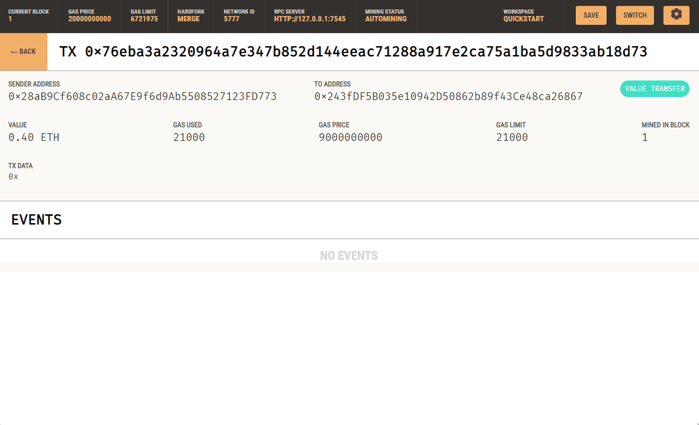

## Unit 19 Homework: Cryptocurrency Wallet

## Step One:
 * Imported the functions *generate_account* , *get_balance* , *send_transaction* from the `crypto_wallet` Class
 * Changed the photo section of *candidate_database* to be the raw links from this github
 * Updated the env file to include the mnemonic from `Ganache`
 * Created the variable *account* and called the *generate_account* function from `crypto_wallet`
 * Called the *get_balance* and passted the account address through it, and displayed using **st.sidebar**

## Step two:
* Wrote the *wage* variable with the equation based on the candidates hourly rate.
* Called on the *send_transaction* function with the parameters, and returned and saved the transaction hash
* Launched `Streamlit` and recorded the process of the application in process
  

### a screenshot of the transaction

## Thank you this was my submission for assignment 19
